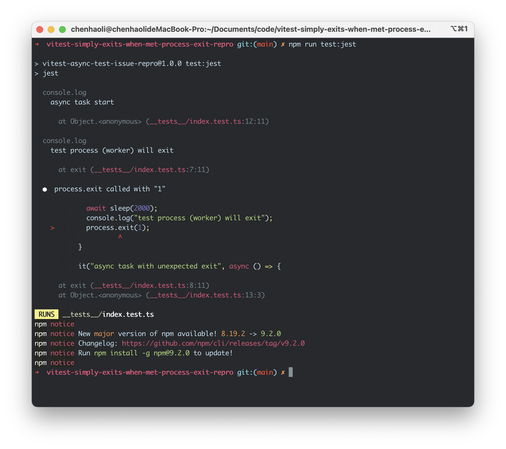

# vitest-simply-exits-when-met-process-exit-repro

## Summary

vitest will simply exit if the test contains an unexpected `process.exit` call, This may be very bad for troubleshooting some asynchronous tasks from from dependencies.

## Step to reproduce

1. `pnpm i`
2. Run `pnpm test`, you will notice that `vitest` will not give you any logs:

3. Run `pnpm test` to execute same test with `jest`, you'll find that jest is able to tell you what went wrong:

